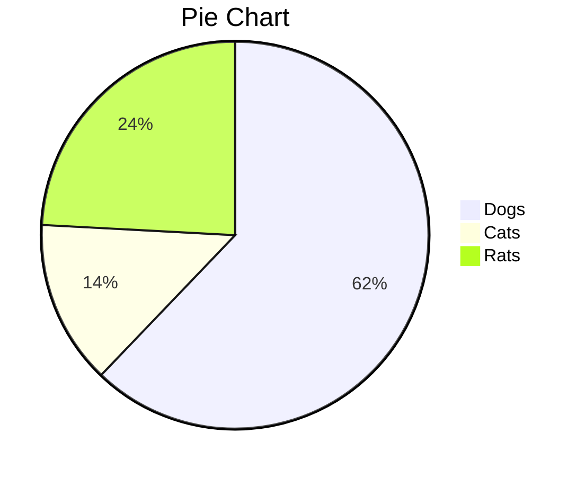
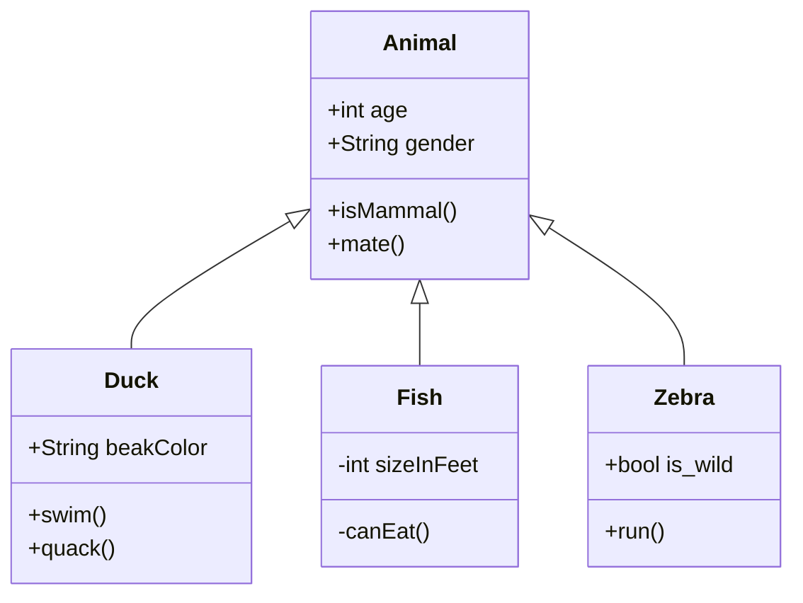
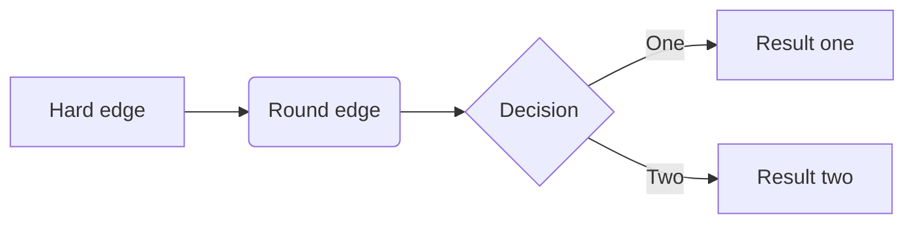
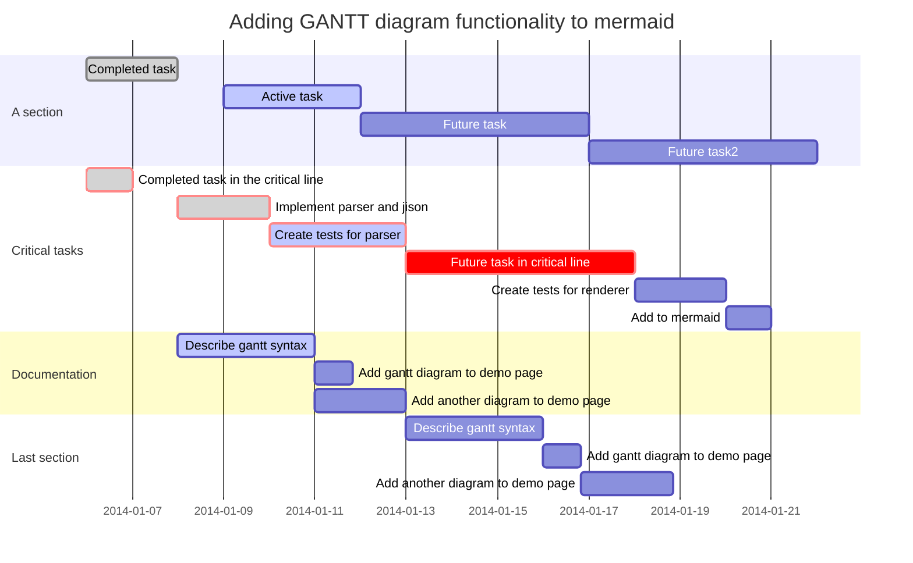
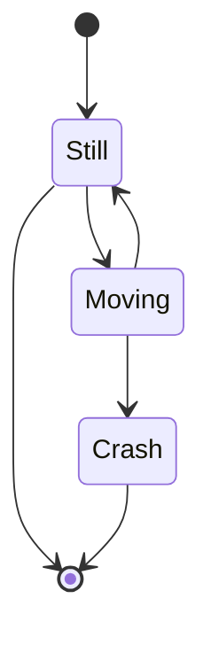
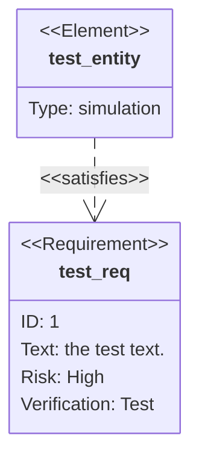

# Markdown syntax guide

참고 사이트 : 
[별감아카이빙](https://riedel.tistory.com/769)
[마크다운라이브 피리뷰](https://markdownlivepreview.com/)

## Headers

# This is a Heading h1

## This is a Heading h2

###### This is a Heading h6

## Emphasis

*This text will be italic*  
_This will also be italic_

**This text will be bold**  
__This will also be bold__

_You **can** combine them_

## Lists

### Unordered

* Item 1
* Item 2
* Item 2a
* Item 2b

### Ordered

1. Item 1
2. Item 2
3. Item 3
   1. Item 3a
   2. Item 3b

## Images


## Links

You may be using [Markdown Live Preview](https://markdownlivepreview.com/).

## Blockquotes

> Markdown is a lightweight markup language with plain-text-formatting syntax, created in 2004 by John Gruber with Aaron Swartz.
>
> > Markdown is often used to format readme files, for writing messages in online discussion forums, and to create rich text using a plain text editor.

## Tables

| Left columns | Right columns |
| ------------ | :-----------: |
| left foo     |   right foo   |
| left bar     |   right bar   |
| left baz     |   right baz   |

## Blocks of code

```
let message = 'Hello world';
alert(message);
```

## Inline code

This web site is using `markedjs/marked`.







```sequence
Alice->Bob: Hello Bob, how are you?
Note right of Bob: Bob thinks
Bob-->Alice: I am good thanks!
```


```flow
st=>start: Start
op=>operation: Your Operation
cond=>condition: Yes or No?
e=>end

st->op->cond
cond(yes)->e
cond(no)->op
```









